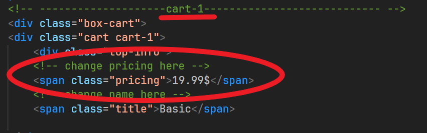
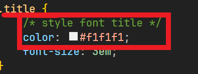
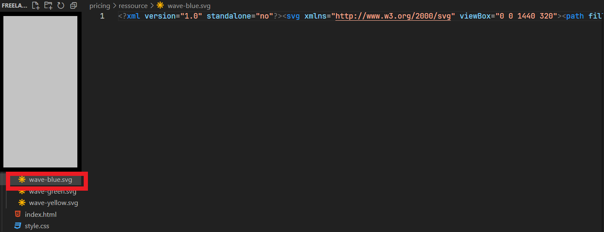
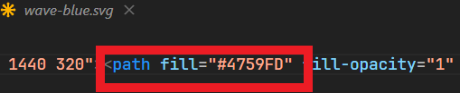

# Credits
*** (all resources are free to use) ***
Thanks for :

*** Fonts : ***
Prodigy Sans is licensed under the SIL Open Font License v1.1 (<http://scripts.sil.org/OFL>)

*** Tools : ***
https://getwaves.io

*** Tutorial ***
# Change information
If you want change the information:

- Choice the cart 

- Search the information (example: pricing)

- Change information 

Ex. (Span class="pricing">25$<\span)

# Change style
If you want change the style: 
- go in the style file (style.css)
Search the style (example: the color of the title):

- Change color ex. (Color: #333)

# Change color of wave :

- Go file resource 
- Choice your wave 

- Duplicate or change one directly wave
- Search color

- Change the color
Ex (file="#333")

